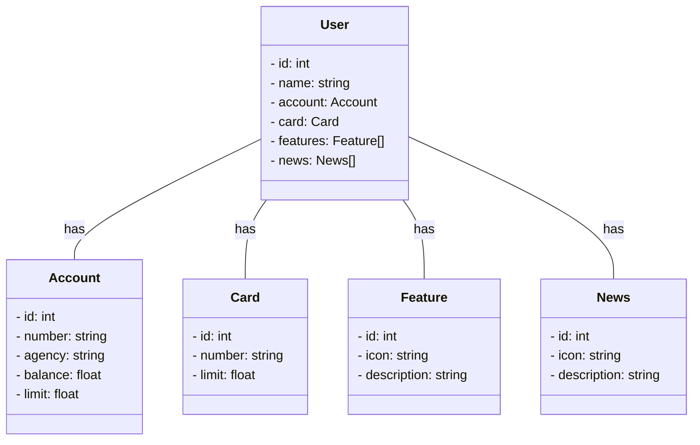

# Santander-BootCamp
Ultimo desafio do bootCamp Santander backend DIO, Java RESTful API

## Diagrama de classes

```mermaid

classDiagram
    class User {
        - id: int
        - name: string
        - account: Account
        - card: Card
        - features: Feature[]
        - news: News[]
    }

    class Account {
        - id: int
        - number: string
        - agency: string
        - balance: float
        - limit: float
    }

    class Card {
        - id: int
        - number: string
        - limit: float
    }

    class Feature {
        - id: int
        - icon: string
        - description: string
    }

    class News {
        - id: int
        - icon: string
        - description: string
    }

    User -- Account: has
    User -- Card: has
    User -- Feature: has
    User -- News: has

```
